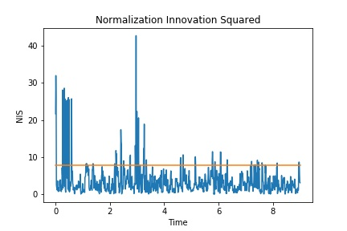

# SFND_Unscented_Kalman_Filter


Sensor Fusion UKF Highway Project Code  


In this project We implement an Unscented Kalman Filter to estimate the state of multiple cars on a highway using noisy lidar and radar measurements. 

The main program can be built and ran by doing the following from the project top directory.

1. mkdir build
2. cd build
3. cmake ..
4. make
5. ./ukf_highway

`main.cpp` is using `highway.h` to create a straight 3 lane highway environment with 3 traffic cars and the main ego car at the center. 
The viewer scene is centered around the ego car and the coordinate system is relative to the ego car as well. The ego car is green while the 
other traffic cars are blue. The traffic cars will be accelerating and altering their steering to change lanes. Each of the traffic car's has
it's own UKF object generated for it, and will update each indidual one during every time step. 

---

### Initializes


**1.Initial state covariance matrix P**

```
P_ << 1, 0, 0, 0, 0,
         0, 1, 0, 0, 0,
         0, 0, 1, 0, 0,
         0, 0, 0, M_PI, 0,
         0, 0, 0, 0, 1;
```

**2.Process noise standard deviation longitudinal acceleration**  

`std_a_ = 4;`  

**3.Process noise standard deviation yaw acceleration**

`std_yawdd_ = 1.0;`  


### Results

Passing the project requires obtaining RMSE values that are lower that the tolerance outlined in the project rubric. 

`rmseThreshold = {0.30,0.16,0.95,0.70};`

**Normalizated Innovation Squared**

Here, we run a consistency check on the radar filter.The image below is result:



As you can see from the image; we have 95% line which value is 7.8;That is to say, our NIS value should have a 5% probability of exceeding this line;However, the data on our graph is far exceeds this value; this mainly appears when the vehicle is doing curvilinear motion. This is where our project needs to be improved.


